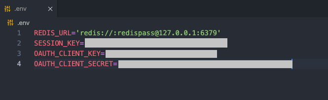
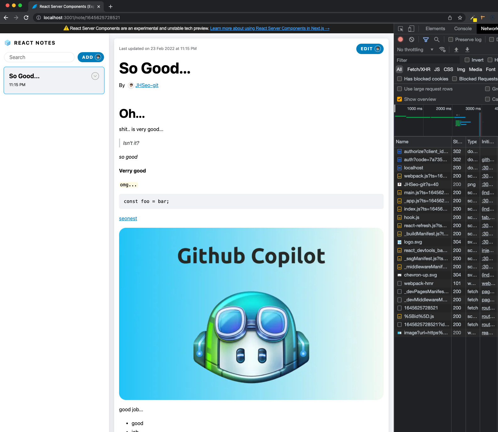
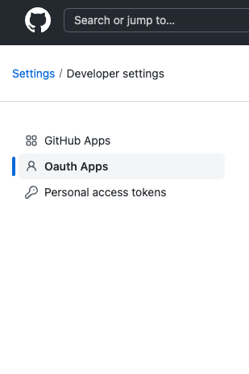
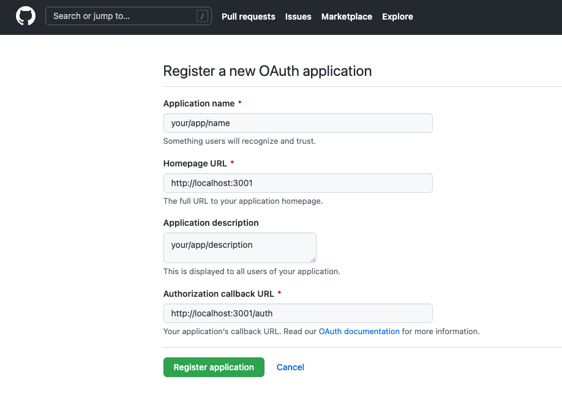
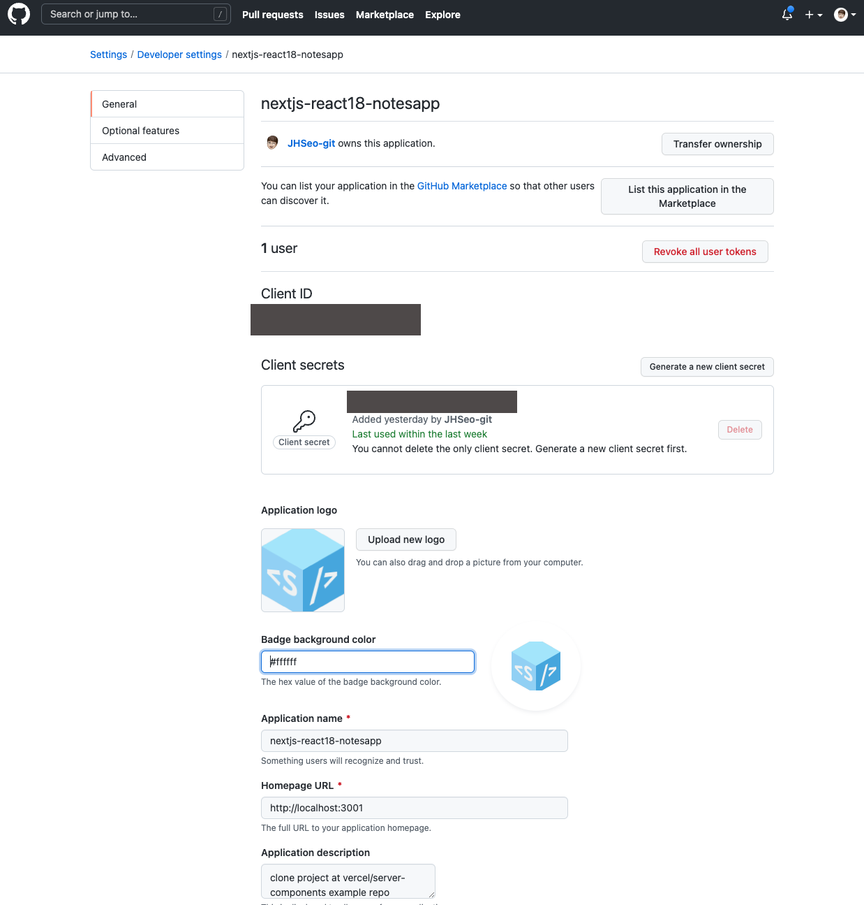

# preprare-react18-with-nextjs

Prepare react@18 with nextjs through https://github.com/vercel/server-components-notes-demo

## getting started

setting for local development

0. INSTALL: after clone(or create) a project, `npm install` or `yarn`
1. DB: redis docker, see [redis.md](./docker/redis/redis.md)
2. CONFIG: fill in the `.env` file about redis url and port  
   
3. OAUTH: github app register see [following section](#github-oauth)
4. RUN: `yarn dev` / `yarn build` and `yarn start`  
   

## typescript react@rc, react-dom@rc

see [tsconfig.json](./tsconfig.json)

```json
{
  "compilerOptions": {
    "types": ["react/next", "react-dom/next"],
    ...
  },
}

```

## github oauth

1. github login
2. Settings > Developer settings > Oauth Apps  
   
3. click `New OAuth App`
4. fill out the form  
   
5. Register your app
6. copy the `client_id` and `client_secret` (client_secret should be `generate a new client secret`) to the `.env` file  
     
   

## LICENSE

[MIT](./LICENSE)
