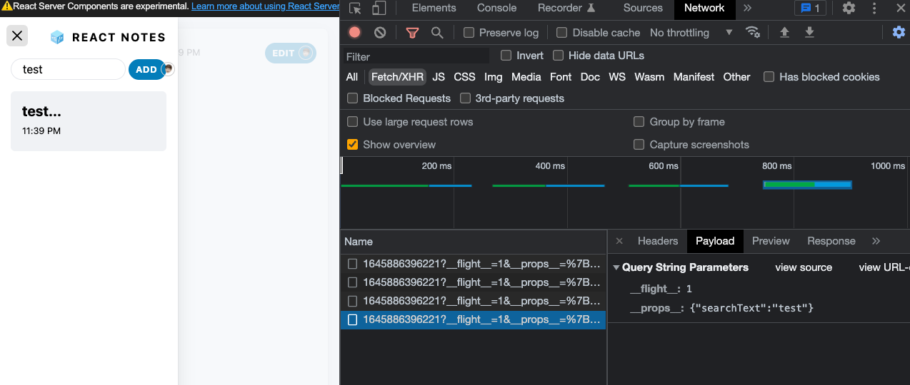

# React Server Component

제대로 분석해봅시다.

프론트엔드 세계는 정말 많은 변화를 가지고, 트렌드가 변합니다.

그 중에서 중심이 되어 움직이는 것이 data fetching과 redering입니다.

최근에는 화면 내에 필요한 부분에서만 hydration하여 사용자 경험을 극대화하는 Nextjs와 같은 프레임워크가 인기를 얻고 있습니다. 이렇게 되면 CSR의 이점과 SSR의 이점을 각각 가지고 사용자에게 웹 서비스를 제공할 수 있습니다.

하지만 이런 구조 또한 완전하지 않고 단점 또한 명확하게 존재합니다. 이 시기가 저는 새로운 큰 변화의 격변기라고 생각됩니다. 과도기 이기도 하며 많은 사람들이 관심있어 하는 트렌드가 되었습니다.

그러던 중 React@18과 함께 등장한 React Server Component는 개발자들의 관심을 끌기 충분 했습니다.

곧 정식 릴리즈를 기다리고 있는 이 시점에 저는 이 React Server Component의 동작방식을 이해함으로써 더 넓은 React 세계, 프론트엔드 세계를 이해해보려고 합니다.

## RSC, SSR, CSR

React Server Component와 Server Side Rendering(이하 SSR or SSG)는 별도로 생각해보는 것이 좋습니다.

## next/streaming

```html
<div id="__next">
  <!--$?-->
  <template id="B:0"></template>
  <!--/$-->
</div>
<div hidden id="S:0">
  <template id="P:1"></template>
</div>
<div hidden id="S:1">
  <div class="container">
    <div class="banner">
      <!-- components -->
    </div>
    <div class="main">
      <!-- components -->
      <section class="col sidebar">
        <!-- components -->
        <nav>
          <!--$?-->
          <template id="B:1"></template>
          <!-- components -->
          <!--/$-->
        </nav>
      </section>
      <section class="col note-viewer">
        <!--$-->
        <div class="note--empty-state">
          <span class="note-text--empty-state"
            >Click a note on the left to view something! 🥺</span
          >
        </div>
        <!--/$-->
      </section>
    </div>
  </div>
</div>
```

```js
function $RS(a, b) {
  a = document.getElementById(a);
  b = document.getElementById(b);
  for (a.parentNode.removeChild(a); a.firstChild; )
    b.parentNode.insertBefore(a.firstChild, b);
  b.parentNode.removeChild(b);
}
$RS('S:1', 'P:1');
```

```js
function $RC(a, b) {
  a = document.getElementById(a);
  b = document.getElementById(b);
  b.parentNode.removeChild(b);
  if (a) {
    a = a.previousSibling;
    var f = a.parentNode,
      c = a.nextSibling,
      e = 0;
    do {
      if (c && 8 === c.nodeType) {
        var d = c.data;
        if ('/$' === d)
          if (0 === e) break;
          else e--;
        else ('$' !== d && '$?' !== d && '$!' !== d) || e++;
      }
      d = c.nextSibling;
      f.removeChild(c);
      c = d;
    } while (c);
    for (; b.firstChild; ) f.insertBefore(b.firstChild, c);
    a.data = '$';
    a._reactRetry && a._reactRetry();
  }
}
$RC('B:0', 'S:0');
```

### unstable_useRefreshRoot

Server Component는 서버사이드에서 렌더링되기 때문에 경우에 따라 서버에서 콘텐츠를 부분적으로 refresh해야 할 수 도 있습니다.

예를 들어 검색을 위해 search bar(client component)가 있고 검색 결과를 위한 search result(RSC)가 있을 때, 입력하는 동안 검색 결과를 업데이트하고 특정 빈도(debounce)로 결과를 다시 렌더링하기를 원할 것입니다.(각 키를 입력하거나 debounce 시)

`unstable_useRefreshRoot` hook은 깜박임 없이 부드럽게 React 트리를 다시 렌더링할 수 있는 API를 반환합니다. `refresh` 함수를 호출하면 트리가 다시 렌더링됩니다. 이 hook은 클라이언트 사이드에서만 사용할 수 있으며 그 순간(refresh)에는 서버 컴포넌트들에게만 영향을 미칠 것입니다.



```js
// pages/index.server.js
import Search from '../components/search.client.js';
import SearchResults from '../components/search-results.server.js';

function Home() {
  return (
    <div>
      <Search />
      <SearchResults />
    </div>
  );
}
```

### RSC response

> `Request URL: http://localhost:3001/?__flight__=1`

```js
M1:{"id":"./node_modules/next/link.js","name":"default","chunks":[]}
M2:{"id":"./src/components/SearchField.client.tsx","name":"default","chunks":[]}
M3:{"id":"./src/components/EditButton.client.tsx","name":"default","chunks":[]}
S4:"react.suspense"
J0:["$","div",null,{"className":"container","children":[["$","div",null,{"className":"banner","children":["$","a",null,{"href":"https://nextjs.org/docs/advanced-features/react-18","target":"_blank","rel":"noopener noreferrer","children":"Learn more about using React Server Components in Next.js →"}]}],["$","div",null,{"className":"main","children":[["$","input",null,{"type":"checkbox","className":"sidebar-toggle","id":"sidebar-toggle"}],["$","section",null,{"className":"col sidebar","children":[["$","@1",null,{"href":"/","children":["$","a",null,{"className":"link--unstyled","children":["$","section",null,{"className":"sidebar-header","children":[["$","img",null,{"className":"logo","src":"/logo.svg","width":"22px","height":"20px","alt":"","role":"presentation"}],["$","strong",null,{"children":"React Notes"}]]}]}]}],["$","section",null,{"className":"sidebar-menu","role":"menubar","children":[["$","@2",null,{}],["$","a",null,{"href":"/note/edit/","className":"link--unstyled","children":["$","@3",null,{"login":"JHSeo-git","children":["Add",["$","img",null,{"src":"https://avatars.githubusercontent.com/JHSeo-git?s=40","alt":"User Avatar","title":"JHSeo-git","className":"avatar"}]]}]}]]}],["$","nav",null,{"children":["$","$4",null,{"fallback":["$","div",null,{"children":["$","ul",null,{"className":"notes-list skeleton-container","children":[["$","li",null,{"className":"v-stack","children":["$","div",null,{"className":"sidebar-note-list-item skeleton","style":{"height":"5em"}}]}],["$","li",null,{"className":"v-stack","children":["$","div",null,{"className":"sidebar-note-list-item skeleton","style":{"height":"5em"}}]}],["$","li",null,{"className":"v-stack","children":["$","div",null,{"className":"sidebar-note-list-item skeleton","style":{"height":"5em"}}]}]]}]}],"children":"@5"}]}]]}],["$","section",null,{"className":"col note-viewer","children":["$","$4",null,{"fallback":["$","div",null,{"className":"note skeleton-container","role":"progressbar","aria-busy":"true","children":[["$","div",null,{"className":"note-header","children":[["$","div",null,{"className":"note-title skeleton","style":{"height":"3rem","width":"65%","marginInline":"12px 1em"}}],["$","div",null,{"className":"skeleton skeleton--button","style":{"width":"8em","height":"2.5em"}}]]}],["$","div",null,{"className":"note-preview","children":[["$","div",null,{"className":"skeleton v-stack","style":{"height":"1.5em"}}],["$","div",null,{"className":"skeleton v-stack","style":{"height":"1.5em"}}],["$","div",null,{"className":"skeleton v-stack","style":{"height":"1.5em"}}],["$","div",null,{"className":"skeleton v-stack","style":{"height":"1.5em"}}],["$","div",null,{"className":"skeleton v-stack","style":{"height":"1.5em"}}]]}]]}],"children":["$","div",null,{"className":"note--empty-state","children":["$","span",null,{"className":"note-text--empty-state","children":"Click a note on the left to view something! 🥺"}]}]}]}]]}]]}]
M6:{"id":"./src/components/SidebarNote.client.tsx","name":"default","chunks":[]}
J5:["$","ul",null,{"className":"notes-list","children":[["$","li","1645886396221",{"children":["$","@6",null,{"id":1645886396221,"title":"test...","expandedChildren":["$","p",null,{"className":"sidebar-note-excerpt","children":"test test test test test21 test testetetst testets react test is good isn't it ?"}],"children":["$","header",null,{"className":"sidebar-note-header","children":[["$","strong",null,{"children":"test..."}],["$","small",null,{"children":"2/26/22"}]]}]}]}],["$","li","1645625728521",{"children":["$","@6",null,{"id":1645625728521,"title":"So Good...","expandedChildren":["$","p",null,{"className":"sidebar-note-excerpt","children":"Oh... shit.. is very good... Isn't it? so good Verry good omg... const foo = bar; seonest good job... good..."}],"children":["$","header",null,{"className":"sidebar-note-header","children":[["$","strong",null,{"children":"So Good..."}],["$","small",null,{"children":"2/23/22"}]]}]}]}]]}]
```

```js
// components/search.client.js
import { unstable_useRefreshRoot as useRefreshRoot } from 'next/streaming';

export default function Search() {
  const refresh = useRefreshRoot();

  return (
    <SearchUI
      onChange={() => {
        refresh();
      }}
    />
  );
}
```
